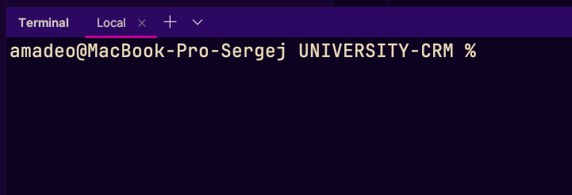
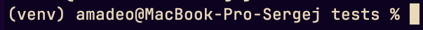
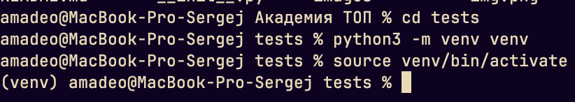

зачем нужно виртуальное окружение?
чтобы вы с лёгкостью смогли управлять своим проектом и нужными ему файлами/пакетами и библиотеками.
pip - стандартный менеджер пакетов. Помимо него существуют и другие менеджеры(Poetry, pyenv, uv).
pip подгружает пакеты с специального сайта https://pypi.org/


Перед началом работы:
1. активируйте виртуальное окружение

1. зайдите в командную строку/терминал, если работаете в pycharm, то нужно нажать сюда:
Откроется примерно следующее:
1.
2. Введите в командную строку(для начала наведите на неё мышкой и сделайте щелчок левой кнопкой) следующую команду:
```bash
python -m venv venv
```

3. должна создаться директория/папка venv в вашем проекте. В том же окне терминала
выполните следующую команду:
```bash
venv\Scripts\activate.bat
```
Это активирует виртуальное окружение, для идентификации успешности проверьте отображение в окне терминала:

в начале появилась приписка "venv"

2. пример активации на macos



Загрузите необходимые библиотеки на свой компьютер

На сегодня вам понадобится загрузить библиотеку для тестирования - unitest

pip install unitest

после выполнения заданий в модуле 3 запускайте следующую команду:
python -m unittest test_functions.py -v